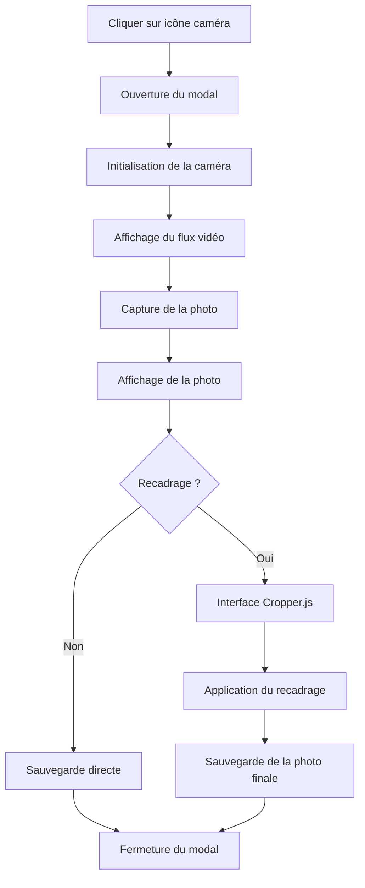

# 📸 Système de Caméra Simplifié - PNC

## 🎯 **Vue d'ensemble**

Le système de caméra a été complètement refactorisé pour être **simple, fonctionnel et fiable**. Il remplace l'ancien système complexe qui ne fonctionnait pas correctement.

## 🚀 **Nouveautés**

### ✅ **Ce qui fonctionne maintenant**
- **Capture de photo** en temps réel depuis la caméra
- **Recadrage d'image** avec Cropper.js
- **Interface intuitive** en 3 étapes
- **Gestion des erreurs** robuste
- **Responsive design** pour mobile et desktop

### 🔧 **Architecture simplifiée**
- **JavaScript natif** au lieu de modules ES6 complexes
- **Communication directe** Blazor ↔ JavaScript
- **Gestion d'état** claire et prévisible
- **Nettoyage automatique** des ressources

## 📁 **Fichiers créés/modifiés**

### **Nouveaux fichiers**
- `wwwroot/js/simple-camera.js` - Gestion JavaScript de la caméra
- `wwwroot/css/camera-modal.css` - Styles du modal de caméra
- `Components/Pages/CameraTest.razor` - Page de test
- `wwwroot/css/camera-test.css` - Styles de la page de test

### **Fichiers modifiés**
- `Components/Pages/Policiers.razor` - Modal de caméra refactorisé
- `Components/App.razor` - Références CSS/JS ajoutées

## 🎥 **Comment ça fonctionne**

### **1. Ouverture du modal**
```csharp
// Clic sur l'icône caméra → ouverture du modal
private async Task OpenCameraModal(string policierId)
{
    selectedPolicierIdForPhoto = policierId;
    showCameraModal = true;
    
    // Initialisation de la caméra
    var success = await JSRuntime.InvokeAsync<bool>("initSimpleCamera");
}
```

### **2. Capture de photo**
```javascript
// JavaScript capture l'image depuis la vidéo
window.capturePhoto = function() {
    const canvas = document.createElement("canvas");
    canvas.width = video.videoWidth;
    canvas.height = video.videoHeight;
    context.drawImage(video, 0, 0);
    
    const photoData = canvas.toDataURL('image/jpeg', 0.9);
    return photoData;
};
```

### **3. Recadrage avec Cropper.js**
```javascript
// Initialisation du recadrage
window.startCropping = function() {
    cropper = new Cropper(photo, {
        aspectRatio: NaN, // Libre
        viewMode: 1,
        dragMode: 'move'
    });
};
```

### **4. Sauvegarde**
```csharp
// Récupération de la photo finale
private async Task SavePhoto()
{
    var photoData = await JSRuntime.InvokeAsync<string>("getFinalPhoto");
    if (!string.IsNullOrEmpty(photoData))
    {
        await SavePhotoToDatabase(photoData);
    }
}
```

## 🧪 **Test du système**

### **Page de test dédiée**
Accédez à `/test-camera-simple` pour tester le système en isolation :

- ✅ **Test de la caméra** : Vérification de l'activation
- ✅ **Test de capture** : Prise de photo
- ✅ **Test de recadrage** : Utilisation de Cropper.js
- ✅ **Test de sauvegarde** : Récupération des données

### **Test dans le contexte réel**
Sur `/policiers`, cliquez sur l'icône caméra d'un policier pour tester le modal intégré.

## 🎨 **Interface utilisateur**

### **3 étapes principales**
1. **🎥 Capture** : Affichage de la caméra + bouton "Prendre une photo"
2. **📷 Édition** : Affichage de la photo + options "Rogner", "Utiliser", "Reprendre"
3. **✂️ Recadrage** : Interface Cropper.js + boutons "Appliquer", "Annuler"

### **Design responsive**
- **Desktop** : Modal de 600px de large
- **Mobile** : Modal de 90-95vw de large
- **Boutons** : Taille adaptée à l'écran

## 🔧 **Configuration requise**

### **Dépendances JavaScript**
```html
<!-- Cropper.js pour le recadrage -->
<script src="https://cdnjs.cloudflare.com/ajax/libs/cropperjs/1.5.13/cropper.min.js"></script>
<link href="https://cdnjs.cloudflare.com/ajax/libs/cropperjs/1.5.13/cropper.min.css" rel="stylesheet"/>

<!-- Notre système simplifié -->
<script src="js/simple-camera.js"></script>
```

### **Permissions navigateur**
- **Caméra** : Accès requis pour la capture
- **HTTPS** : Recommandé pour la production

## 🚨 **Gestion des erreurs**

### **Types d'erreurs gérées**
- **Caméra non disponible** : Message d'erreur clair
- **Permissions refusées** : Instructions pour l'utilisateur
- **Éléments DOM manquants** : Vérification automatique
- **Échec de capture** : Retry automatique

### **Logs de débogage**
```javascript
console.log('📹 Initialisation de la caméra simple...');
console.log('✅ Caméra activée avec succès');
console.log('❌ Erreur caméra : ', err);
```

## 📱 **Compatibilité**

### **Navigateurs supportés**
- ✅ **Chrome** 60+ (recommandé)
- ✅ **Firefox** 55+
- ✅ **Safari** 11+
- ✅ **Edge** 79+

### **Appareils supportés**
- ✅ **Ordinateurs** : Webcams USB et intégrées
- ✅ **Tablettes** : Caméras frontales et arrières
- ✅ **Smartphones** : Caméras principales et selfie

## 🔄 **Workflow complet**



## 🚀 **Prochaines étapes**

### **À implémenter**
1. **Sauvegarde en base** : Intégration avec ImageStorageService
2. **Mise à jour UI** : Rafraîchissement de l'affichage
3. **Validation** : Vérification de la qualité de la photo
4. **Compression** : Optimisation de la taille des fichiers

### **Améliorations possibles**
- **Filtres photo** : Noir et blanc, sépia, etc.
- **Rotation automatique** : Détection de l'orientation
- **Zoom** : Zoom avant/arrière sur la photo
- **Historique** : Sauvegarde des versions précédentes

## 🐛 **Dépannage**

### **Problèmes courants**

#### **Caméra ne s'active pas**
```javascript
// Vérifier les permissions
navigator.permissions.query({ name: 'camera' })
    .then(permission => console.log('Permission:', permission.state));
```

#### **Photo ne se capture pas**
```javascript
// Vérifier l'état de la vidéo
console.log('Video readyState:', video.readyState);
console.log('Video dimensions:', video.videoWidth, 'x', video.videoHeight);
```

#### **Recadrage ne fonctionne pas**
```javascript
// Vérifier que Cropper.js est chargé
console.log('Cropper disponible:', typeof Cropper !== 'undefined');
```

### **Logs de débogage**
Activez la console du navigateur pour voir les messages détaillés :
- 📹 Initialisation de la caméra
- 📸 Capture de photo
- ✂️ Démarrage du recadrage
- ✅ Application du recadrage
- 💾 Sauvegarde de la photo

## 📚 **Références**

- **Cropper.js** : [Documentation officielle](https://github.com/fengyuanchen/cropperjs)
- **MediaDevices API** : [MDN Web Docs](https://developer.mozilla.org/en-US/docs/Web/API/MediaDevices)
- **Canvas API** : [MDN Web Docs](https://developer.mozilla.org/en-US/docs/Web/API/Canvas_API)

---

**🎉 Le système de caméra est maintenant simple, fonctionnel et prêt pour la production !**
