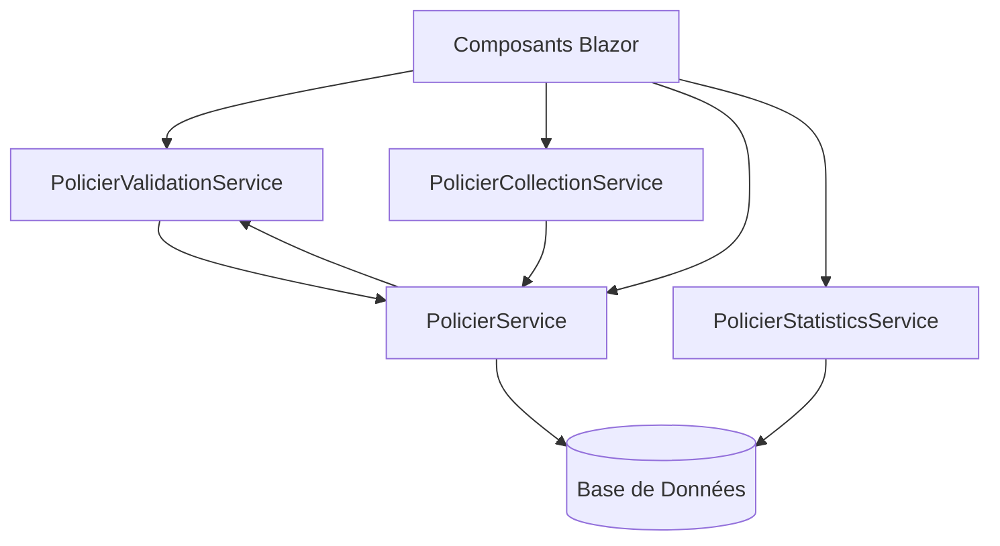

# Services - Architecture des Services Métier

Ce dossier contient tous les services métier de l'application PNC, organisés selon le principe de séparation des responsabilités.

## 📁 Structure des Services

### 1. **PolicierValidationService** (`PolicierValidationService.cs`)
**Responsabilité** : Validation de toutes les données du policier selon les règles métier.

**Fonctionnalités** :
- Validation par étape (7 étapes du formulaire)
- Validation globale de toutes les étapes
- Règles métier : âge minimum/maximum, cohérence des dates, champs obligatoires
- Messages d'erreur personnalisés par champ

**Interface** : `IPolicierValidationService`

### 2. **PolicierCollectionService** (`PolicierCollectionService.cs`)
**Responsabilité** : Gestion des collections d'entités liées au policier.

**Fonctionnalités** :
- Ajout/suppression de conjoints, enfants, formations, langues, sports
- Ajout/suppression de distinctions, affectations, personnes à prévenir, empreintes
- Initialisation correcte des nouvelles entités avec leurs propriétés par défaut
- Gestion des relations avec le policier principal

**Interface** : `IPolicierCollectionService`

### 3. **PolicierService** (`PolicierService.cs`) ⭐ **NOUVEAU**
**Responsabilité** : Gestion de toutes les opérations de base de données sur les policiers.

**Fonctionnalités** :
- **CRUD complet** : Création, lecture, mise à jour, suppression des policiers
- **Recherche avancée** : Par nom, matricule, NUTP, grade, unité
- **Pagination** : Gestion des grandes listes avec pagination
- **Gestion des collections** : Ajout/suppression d'éléments liés
- **Validation et sauvegarde** : Intégration avec le service de validation
- **Gestion des relations** : Mise à jour automatique des IDs de liaison
- **Gestion des erreurs** : Try-catch avec logging des erreurs

**Interface** : `IPolicierService`

### 4. **PolicierStatisticsService** (`PolicierStatisticsService.cs`) ⭐ **NOUVEAU**
**Responsabilité** : Génération de statistiques et rapports sur les policiers.

**Fonctionnalités** :
- **Statistiques générales** : Total, actifs, nouveaux ce mois
- **Statistiques par unité** : Répartition par unité d'affectation
- **Statistiques par grade** : Répartition par grade avec âge moyen
- **Statistiques démographiques** : Répartition par sexe, âge
- **Statistiques de formation** : Types de formation, langues
- **Génération de rapports** : PDF, Excel (placeholders pour implémentation future)

**Interface** : `IPolicierStatisticsService`

### 5. **DateService** (`DateService.cs`)
**Responsabilité** : Gestion des dates et calculs temporels.

**Fonctionnalités** :
- Extraction des composants jour/mois/année d'une date
- Reconstruction d'une date à partir de ses composants
- Calcul d'âge avec précision
- Validation des plages de dates
- Vérification si une date est dans le futur ou le passé

**Interface** : `IDateService`

### 6. **CommissariatService** (`CommissariatService.cs`) ⭐ **NOUVEAU**
**Responsabilité** : Gestion de toutes les opérations sur les commissariats et unités de police.

**Fonctionnalités** :
- **CRUD complet** : Création, lecture, mise à jour, suppression des commissariats
- **Recherche avancée** : Par nom, code, province, territoire, ville
- **Pagination** : Gestion des grandes listes avec pagination
- **Gestion des policiers affectés** : Affectation/désaffectation de policiers
- **Validation et vérification** : Unicité des codes et noms
- **Statistiques** : Nombre de policiers par commissariat, répartition par grade et sexe
- **Gestion des erreurs** : Try-catch avec logging des erreurs

**Interface** : `ICommissariatService`

### 7. **DateService** (`DateService.cs`)
**Responsabilité** : Gestion des dates et calculs temporels.

**Fonctionnalités** :
- Extraction des composants jour/mois/année d'une date
- Reconstruction d'une date à partir de ses composants
- Calcul d'âge avec précision
- Validation des plages de dates
- Vérification si une date est dans le futur ou le passé

**Interface** : `IDateService`

### 8. **ValidationResult** (`ValidationResult.cs`)
**Responsabilité** : Gestion des résultats de validation.

**Fonctionnalités** :
- Stockage des erreurs par champ
- Méthodes pour ajouter/supprimer des erreurs
- Fusion de résultats de validation
- Vérification de la validité globale
- Formatage des messages d'erreur

## 🔧 Utilisation des Services

### Injection de Dépendances
Les services sont enregistrés dans `Program.cs` et peuvent être injectés dans les composants Blazor :

```csharp
@inject IPolicierValidationService ValidationService
@inject IPolicierCollectionService CollectionService
@inject IPolicierService PolicierService
@inject IPolicierStatisticsService StatisticsService
@inject ICommissariatService CommissariatService
@inject IDateService DateService
```

### Exemple d'Utilisation

#### **Validation et Sauvegarde**
```csharp
// Validation d'une étape
var validationResult = ValidationService.ValidateStep1(Policier);
if (!validationResult.IsValid)
{
    // Traitement des erreurs
    foreach (var error in validationResult.Errors)
    {
        // Affichage des erreurs
    }
}

// Validation et sauvegarde complète
var success = await PolicierService.ValidateAndSavePolicierAsync(Policier);
```

#### **Opérations de Base de Données**
```csharp
// Récupération de tous les policiers avec pagination
var policiers = await PolicierService.GetPoliciersPaginatedAsync(1, 20);

// Recherche par terme
var searchResults = await PolicierService.SearchPoliciersAsync("Dupont");

// Vérification d'unicité
var isMatriculeUnique = await PolicierService.IsMatriculeUniqueAsync("M12345");
```

#### **Gestion des Collections**
```csharp
// Ajout d'un conjoint
CollectionService.AddConjoint(Policier);

// Sauvegarde en base
await PolicierService.AddConjointToPolicierAsync(Policier.Id, conjoint);
```

#### **Statistiques**
```csharp
// Statistiques générales
var summary = await StatisticsService.GetStatisticsSummaryAsync();
Console.WriteLine($"Total: {summary.TotalPoliciers}");

// Statistiques par unité
var uniteStats = await StatisticsService.GetUniteStatisticsAsync();
foreach (var stat in uniteStats)
{
    Console.WriteLine($"{stat.UniteName}: {stat.TotalPoliciers} policiers");
}
```

#### **Gestion des Commissariats**
```csharp
// Récupération de tous les commissariats
var commissariats = await CommissariatService.GetAllCommissariatsAsync();

// Recherche par province
var commissariatsProvince = await CommissariatService.GetCommissariatsByProvinceAsync("Kinshasa");

// Statistiques d'un commissariat
var stats = await CommissariatService.GetCommissariatStatisticsAsync(commissariatId);
Console.WriteLine($"Policiers: {stats.TotalPoliciers}");

// Affectation d'un policier
await CommissariatService.AssignPolicierToCommissariatAsync(policierId, commissariatId);
```

## 🎯 Avantages de cette Architecture

1. **Séparation des Responsabilités** : Chaque service a une responsabilité claire et unique
2. **Testabilité** : Les services peuvent être testés indépendamment
3. **Réutilisabilité** : Les services peuvent être utilisés dans différents composants
4. **Maintenabilité** : Code organisé et facile à maintenir
5. **Injection de Dépendances** : Gestion automatique des instances et de leur cycle de vie
6. **Interface Segregation** : Chaque service expose uniquement les méthodes nécessaires
7. **Gestion des Erreurs** : Try-catch centralisé avec logging
8. **Performance** : Utilisation optimisée d'Entity Framework avec Include
9. **Scalabilité** : Architecture prête pour l'évolution future

## 🚀 Évolution Future

Cette architecture permet d'ajouter facilement de nouveaux services :
- **PolicierNotificationService** : Notifications et alertes
- **PolicierAuditService** : Audit et traçabilité
- **PolicierExportService** : Export de données (Excel, CSV)
- **PolicierImportService** : Import de données en lot
- **PolicierWorkflowService** : Gestion des processus métier
- **PolicierSecurityService** : Gestion des permissions et sécurité

## 📋 Règles de Nommage

- **Interfaces** : Préfixées par `I` (ex: `IPolicierService`)
- **Classes** : Suffixées par `Service` (ex: `PolicierService`)
- **Méthodes** : Verbe + nom (ex: `GetPoliciersPaginatedAsync`, `ValidateAndSavePolicierAsync`)
- **Fichiers** : Même nom que la classe principale
- **Modèles de données** : Suffixés par le type (ex: `StatisticsSummary`, `UniteStatistics`)

## 🔄 Flux de Données



## 📊 Gestion des Erreurs

Tous les services implémentent une gestion d'erreur cohérente :
- **Try-catch** sur toutes les opérations de base de données
- **Logging** des erreurs avec Console.WriteLine (à remplacer par un vrai logger)
- **Retour de booléen** pour indiquer le succès/échec
- **Messages d'erreur** détaillés pour le débogage
