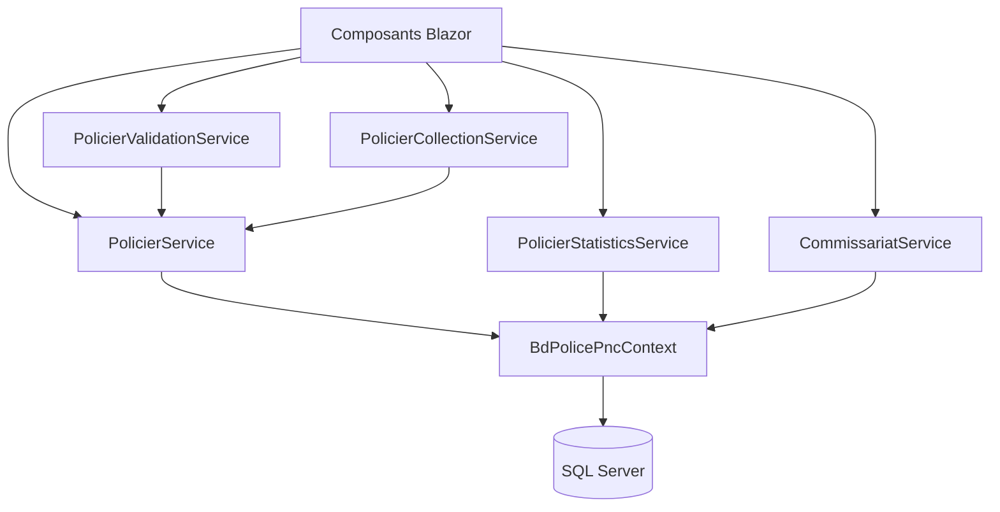

# System Patterns - PNC

## Architecture Overview

### N-Tier Architecture
L'application PNC suit une architecture en couches bien définie :

```
┌─────────────────────────────────────┐
│           Presentation Layer        │
│         (Blazor Components)        │
├─────────────────────────────────────┤
│            Business Layer           │
│           (Services)                │
├─────────────────────────────────────┤
│            Data Access Layer        │
│      (Entity Framework Context)     │
├─────────────────────────────────────┤
│            Database Layer           │
│           (SQL Server)              │
└─────────────────────────────────────┘
```

### Component Relationships


## Design Patterns

### 1. Service Layer Pattern
**Objectif** : Centraliser la logique métier et séparer les responsabilités

**Implémentation** :
- `IPolicierService` : Interface pour les opérations CRUD
- `PolicierService` : Implémentation concrète
- `IPolicierValidationService` : Interface pour la validation
- `PolicierValidationService` : Implémentation de la validation

**Avantages** :
- Séparation claire des responsabilités
- Testabilité améliorée
- Réutilisabilité du code
- Maintenance facilitée

### 2. Repository Pattern
**Objectif** : Abstraire l'accès aux données et centraliser les opérations de base

**Implémentation** :
- `BdPolicePncContext` : Contexte Entity Framework
- Services utilisent directement le contexte
- Méthodes de requête centralisées dans les services

**Exemple** :
```csharp
public async Task<IEnumerable<Policier>> GetPoliciersPaginatedAsync(int page, int pageSize)
{
    return await _context.Policiers
        .Include(p => p.IdCommissariatNavigation)
        .Skip((page - 1) * pageSize)
        .Take(pageSize)
        .ToListAsync();
}
```

### 3. Dependency Injection Pattern
**Objectif** : Gérer automatiquement les dépendances et faciliter les tests

**Configuration** (Program.cs) :
```csharp
builder.Services.AddScoped<IPolicierService, PolicierService>();
builder.Services.AddScoped<IPolicierValidationService, PolicierValidationService>();
builder.Services.AddScoped<IPolicierCollectionService, PolicierCollectionService>();
```

**Utilisation** :
```csharp
@inject IPolicierService PolicierService
@inject IPolicierValidationService ValidationService
```

### 4. Validation Pattern
**Objectif** : Centraliser la validation métier et assurer la cohérence des données

**Structure** :
- `ValidationResult` : Classe de résultat de validation
- `PolicierValidationService` : Service de validation centralisé
- Validation par étape et validation globale

**Exemple** :
```csharp
public ValidationResult ValidateStep1(Policier policier)
{
    var result = new ValidationResult();
    
    if (string.IsNullOrEmpty(policier.Nom))
        result.AddError("Nom", "Le nom est obligatoire");
    
    if (policier.DateNaissance > DateTime.Now)
        result.AddError("DateNaissance", "La date de naissance ne peut pas être dans le futur");
    
    return result;
}
```

### 5. Collection Management Pattern
**Objectif** : Gérer les collections d'entités liées de manière cohérente

**Implémentation** :
- `PolicierCollectionService` : Gestion des collections
- Méthodes d'ajout/suppression centralisées
- Initialisation correcte des nouvelles entités

**Exemple** :
```csharp
public void AddConjoint(Policier policier)
{
    var conjoint = new Conjoint
    {
        Id = Guid.NewGuid().ToString(),
        IdPolicier = policier.Id,
        DateCreation = DateTime.Now
    };
    
    policier.Conjoints.Add(conjoint);
}
```

## Data Flow Patterns

### 1. CRUD Operations Flow
```
Create: UI → Service → Validation → Database
Read:   UI → Service → Database → UI
Update: UI → Service → Validation → Database
Delete: UI → Service → Validation → Database
```

### 2. Validation Flow
```
User Input → Service → Validation Service → Validation Result → UI Feedback
```

### 3. Collection Management Flow
```
Add Item → Collection Service → Update Model → Save to Database
Remove Item → Collection Service → Update Model → Save to Database
```

## Error Handling Patterns

### 1. Try-Catch Pattern
**Objectif** : Gérer les erreurs de manière cohérente et informer l'utilisateur

**Implémentation** :
```csharp
try
{
    var result = await _context.SaveChangesAsync();
    return true;
}
catch (Exception ex)
{
    Console.WriteLine($"Erreur lors de la sauvegarde: {ex.Message}");
    return false;
}
```

### 2. Validation Result Pattern
**Objectif** : Retourner des résultats de validation structurés

**Structure** :
```csharp
public class ValidationResult
{
    public bool IsValid => !Errors.Any();
    public Dictionary<string, List<string>> Errors { get; set; } = new();
    
    public void AddError(string field, string message)
    {
        if (!Errors.ContainsKey(field))
            Errors[field] = new List<string>();
        Errors[field].Add(message);
    }
}
```

## Performance Patterns

### 1. Pagination Pattern
**Objectif** : Gérer efficacement les grandes listes de données

**Implémentation** :
```csharp
public async Task<IEnumerable<Policier>> GetPoliciersPaginatedAsync(int page, int pageSize)
{
    return await _context.Policiers
        .Include(p => p.IdCommissariatNavigation)
        .Skip((page - 1) * pageSize)
        .Take(pageSize)
        .ToListAsync();
}
```

### 2. Eager Loading Pattern
**Objectif** : Charger les données liées en une seule requête

**Implémentation** :
```csharp
var policier = await _context.Policiers
    .Include(p => p.IdCommissariatNavigation)
    .Include(p => p.Conjoints)
    .Include(p => p.Enfants)
    .FirstOrDefaultAsync(p => p.Id == id);
```

### 3. Command Timeout Pattern
**Objectif** : Gérer les requêtes longues et éviter les timeouts

**Configuration** :
```csharp
builder.Services.AddDbContextFactory<BdPolicePncContext>(options =>
    options.UseSqlServer(connectionString,
        sqlOptions => sqlOptions.CommandTimeout(1200) // 20 minutes
    ));
```

## Security Patterns

### 1. Input Validation Pattern
**Objectif** : Valider toutes les entrées utilisateur

**Implémentation** :
- Validation côté serveur obligatoire
- Validation côté client pour l'expérience utilisateur
- Sanitisation des données avant sauvegarde

### 2. Audit Pattern
**Objectif** : Tracer toutes les modifications pour la sécurité

**Structure** :
- Table `Audit` pour enregistrer les modifications
- Horodatage automatique des opérations
- Identification de l'utilisateur effectuant l'opération

## Evolution Patterns

### 1. Interface Segregation
**Objectif** : Créer des interfaces spécifiques et cohérentes

**Exemple** :
```csharp
public interface IPolicierService
{
    Task<IEnumerable<Policier>> GetPoliciersAsync();
    Task<Policier> GetPolicierByIdAsync(string id);
    Task<bool> CreatePolicierAsync(Policier policier);
    Task<bool> UpdatePolicierAsync(Policier policier);
    Task<bool> DeletePolicierAsync(string id);
}
```

### 2. Extension Points
**Objectif** : Permettre l'ajout facile de nouvelles fonctionnalités

**Mécanismes** :
- Services injectables
- Interfaces extensibles
- Composants Blazor modulaires
- Configuration externalisée
